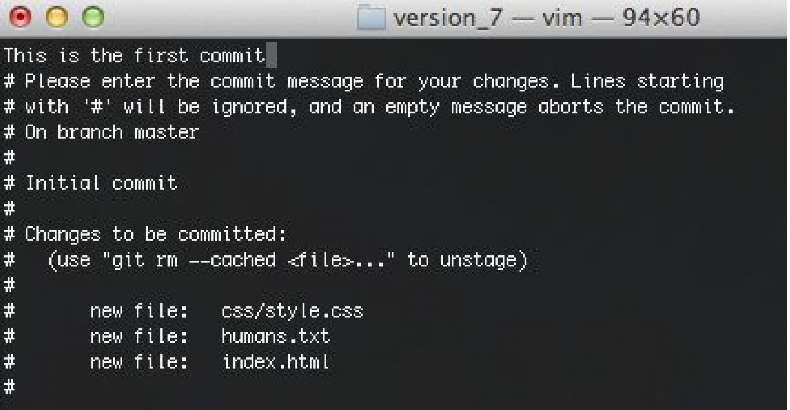

# Cheatsheet Bash

(D'après le tutorial fait par la promotion INFONUM 2021)

On utilise une interface appelée shell pour communiquer entre l'utilisateur et le système
d'exploitation. Bash est un shell très répandu. L'utilisateur interagit avec le shell via une CLI
(Command Line Interface, ou Interface en Ligne de Commande), c'est-à-dire en tapant des lignes de
code qui contiennent les commandes que le système d'exploitation doit exécuter. Un terminal est un
programme qui ouvre une fenêtre graphique dans laquelle les utilisateurs peuvent taper ces
commandes.

## Ouvrir un shell
* VSCode contient un terminal intégré (View > Terminal), qui donne accès au shell Bash.
* Windows permet d'accéder au shell cmd, ou au shell PowerShell
* Sous Mac, c'est Terminal, pour accéder au shell Bash
*  Sous Ubuntu, le Terminal permet de lancer le shell Bash
*   Si vous avez une distribution plus exotique, vous n'avez probablement pas besoin de cette
section du tuto

## Commandes
Tous ces terminaux ouvrent des shells différents ; chaque shell a des différences subtiles dans les
commandes qu'ils sont capables d'interpréter. Néanmoins, les commandes suivantes sont utilisables
dans n'importe quel terminal :

* `pwd` : donne le nom du dossier parent. Utile pour comprendre où vous avez mis votre dossier
de travail.
* `cd folder_name` : "change directory". Permet de se déplacer dans l'arborescence de fichiers.
	* Exemple : `cd Documents` pour rentrer dans le dossier "Documents" ; `cd ..` pour remonter
d'un cran dans l'arborescence ( retourner au dossier parent)
* `ls` : afficher les dossiers et fichiers du répertoire courant. Utile pour vérifier pourquoi votre
autocomplete ne marche pas, ou si vous avez correctement réussi à bouger ou créer des fichiers
* `mkdir folder_name` : créer un dossier
* `touch file_name` : créer un fichier
* `mv path/towards/folder_name new/path/towards/folder_name new/path/please/folder_name` : déplacer un dossier.

## :point_right: J'ai ouvert nano

nano est un éiteur de texte minimaliste. 

Quelques commandes de base :

+ `ctrl+o` pour quitter en sauvegardant
+ `ctrl+x` pour quitter. S'il y a des changements nano demandera si on veut sauvegarder

## :point_right: J'ai ouvert vim (ce qui est très probable lors d'un commit git)

Vim est un éditeur en ligne de commande. On le reconnaît souvent au mot-clé "vim" dans le header (voir
image), et à l'absence des aides de navigation en bas de l'écran (contrairement à nano, voir image plus
haut). La plupart des commandes sont tapées directement, pas besoin de la touche 'entrée' pour les
valider.

* `i` : entrer en mode insertion (pour écrire du texte). Il y aura marqué "insert" en bas.
* `esc` : sortir du mode insertion
* `:x` ou `:wq` pour quitter en sauvegardant
* `:q` pour quitter sans sauvegarder
