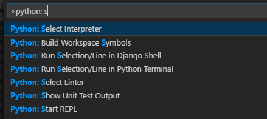
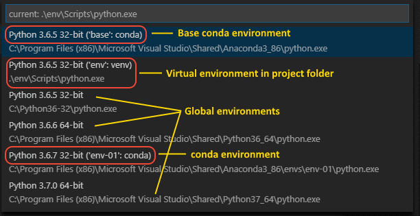

# Python et environnements

## Connaître sa version de python

Pour vérifier la version de python installer sur votre système il suffit de taper dans l'interpréteur de commandes:

```
python -V
```

ou

```
python --version
```


Dans un script python on peut passer par le module sys (source)

```
import sys
print (sys.version)

```

## Les environnements python

En python, on utilise très souvent ce qu'on appelle des environnements python. Un "environnement" en Python est le contexte dans lequel un programme Python s'exécute et consiste en un interpréteur et un nombre quelconque de paquets installés.

###  Environnement global et virtuel 

Par défaut, tout interpréteur Python que vous avez installé s'exécute dans son propre **environnement global**, qui n'est pas spécifique à un projet particulier. Par exemple, si vous lancez `python` (Windows) ou `python3` (macOS/Linux) à une nouvelle invite de commande, vous vous exécutez dans l'environnement global de cet interpréteur. Par conséquent, tout paquet que vous installez ou désinstallez affecte l'environnement global et tous les programmes que vous exécutez dans ce contexte.

Bien que travailler dans l'environnement global soit un moyen facile de démarrer, cet environnement sera, au fil du temps, encombré de nombreux paquets différents que vous avez installés pour différents projets.

Pour cette raison, les développeurs créent souvent un **environnement virtuel** pour un projet donné. Un environnement virtuel est un sous-dossier dans un projet qui contient une copie d'un interpréteur spécifique. Lorsque vous activez l'environnement virtuel, tous les paquets que vous installez sont installés uniquement dans le sous-dossier de cet environnement. Lorsque vous exécutez un programme Python dans cet environnement, vous savez qu'il s'exécute uniquement avec ces paquets spécifiques.

Sachez que si vous n'utilisez pas d'environnement virtuel et que vous avez plusieurs versions de Python installées et définies dans la variable d'environnement path, vous devrez peut-être spécifier l'interpréteur Python à utiliser dans le terminal pour installer les paquets dans l'environnement global.


Voici les rudiments à connaître pour utiliser un environnement virtuel.

* Pour créer un environnement virtuel, tapez la commande :

```
python -m venv env1
```
où `env1` est le nom du répertoire qui sera créé.

* Pour activer l’environnement virtuel, c’est à dire configurer la session de l’utilisateur pour utiliser cette installation de Python plutôt que celle du système, tapez la commande :

```
source env1/bin/activate
```

Générallement, l’invite de commande sera modifiée pour afficher, entre parenthèses, le nom de l’environnement virtuel (ici `(env1)`).


* Pour instaler une librairie dans l’environnement virtuel, assurez-vous de bien l’avoir activé, puis tapez la commande :

```
pip install la_librairie
```

* Pour désactiver l’environnement virtuel, c’est à dire reconfigurer la session de l’utilisateur pour utiliser l’installation système de Python, tapez la commande :

```
deactivate
```


### Environnement conda

Un environnement conda est un environnement Python géré à l'aide du gestionnaire de paquets [`conda`](https://conda.io/projects/conda/en/latest/user-guide/getting-started.html). Conda fonctionne bien pour créer des environnements avec des dépendances interdépendantes ainsi que des paquets binaires. Contrairement aux environnements virtuels, qui sont limités à un projet, les environnements conda sont disponibles globalement sur un ordinateur donné. Cette disponibilité permet de configurer facilement plusieurs environnements Conda distincts, puis de choisir celui qui convient à un projet donné.


## Selectionner et activer un environnement dans VSCode

Par défaut, l'extension Python recherche et utilise le premier interpréteur Python qu'elle trouve dans le chemin du système. Pour sélectionner un environnement spécifique, utilisez la commande Python : Sélectionner l'interpréteur dans la palette de commandes (`⇧⌘P`).




La commande Python `: Select Interpreter` affiche une liste des environnements globaux, des environnements conda et des environnements virtuels disponibles. L'image suivante, par exemple, montre plusieurs installations d'Anaconda et de Python ainsi qu'un environnement conda et un environnement virtuel (env) situé dans le dossier de l'espace de travail :





L'extension Python utilise l'environnement sélectionné pour exécuter du code Python (à l'aide de la commande `Python : Run Python File in Terminal`), fournir des services linguistiques (auto-complétion, vérification syntaxique, linting, formatage, etc.) lorsque vous avez un fichier .py ouvert dans l'éditeur, et ouvrir un terminal avec la commande `Terminal : Créer un nouveau terminal`. Dans ce dernier cas, VS Code a automatiquement activé l'environnement sélectionné.


La barre de statut indique toujours quel est l'environnement sélectionné.


